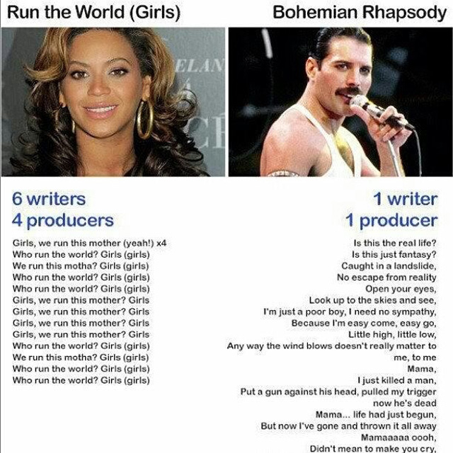
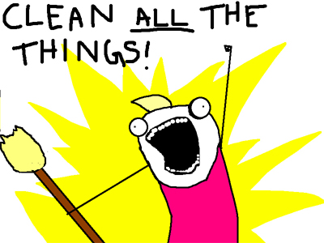
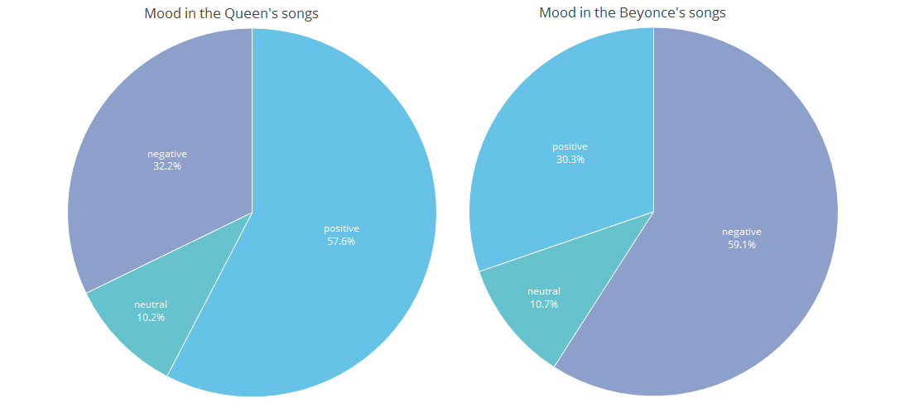
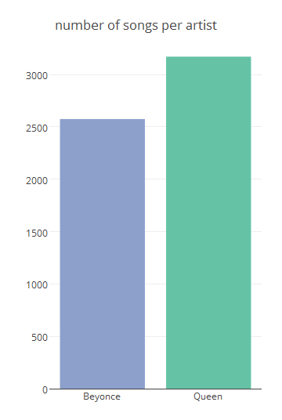
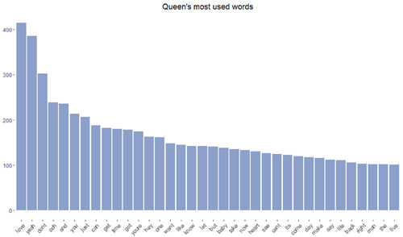
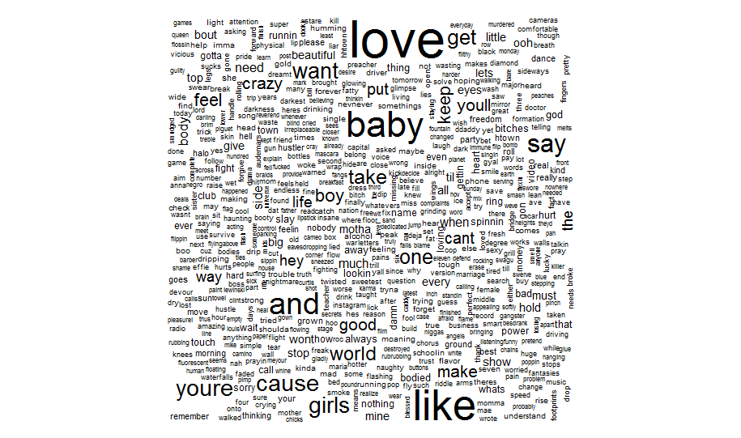
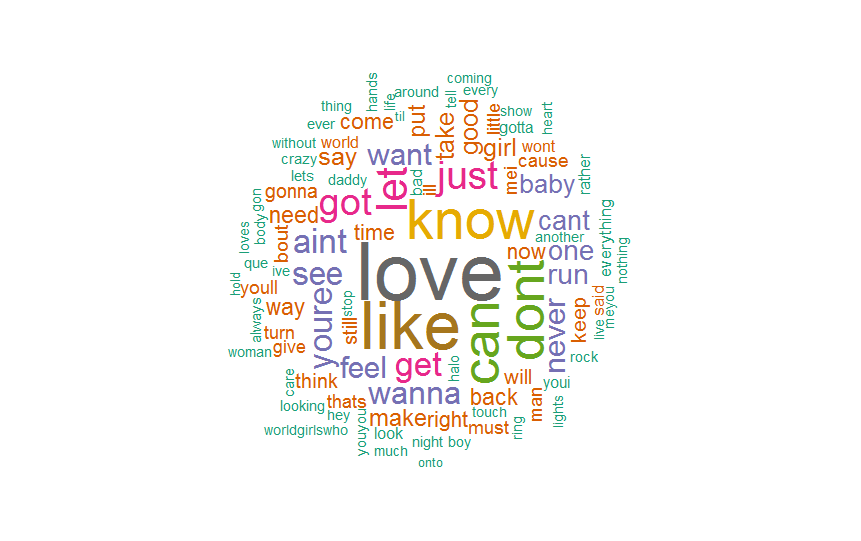

#### Step by step data analysis. Also: What is sentiment analysis? How to create a wordcloud? What is wrong with Beyoncé?


Hey guys! I was recently scrolling through some memes and came across this:
<p align="center">
  
</p>

<p align="justify">You have surely seen this before, haven't you? I like Beyoncé. Like, a lot. But I'm also aware that nowadays popular music is not so sophisticated. Is it? What a great question we can answer right now with a little analytic skills! Let's go and check, if Freddie Mercury's texts are FAR better than those of Beyoncé (what one of my friends is constantly pointing out to me, so yes, I will be doing this analysis only to throw it at his face saying "AHHHAAAAAA!". Back to the post now.)</p>

What should we do:
 - collect and explore the data
 - clear the data
 - analyze the data
 - present the results
 
 What will we need?
- Lyrics of Freddie Mercury's songs
- Lyrics of Beyoncé's songs
- RStudio and some special libraries
 
## Part 1 - Clearing the data.

##### Let's go!
<p align="justify">For lyrics, you can go to <a href="https://www.kaggle.com/gyani95/380000-lyrics-from-metrolyrics">this</a> Kaggle site and download the 99Mb dataset that contains Beyoncé's songs, and then to <a href="https://www.kaggle.com/mousehead/songlyrics">this</a> Kaggle site that contains dataset with Queen's songs.</p>

<p align="justify">Then, we have to launch RStudio, load the data, inspect it, clear it, and prepare the subsets that will be analysed.</p>

 1. Load the data:

```
setwd("C:/computor/directory_with_your_downloaded_data/")
songdata <- read.csv(file="songdata.csv")
lyrics <- read.csv(file="lyrics.csv")
```

 2. Inspect it:

```
str(songdata)
'data.frame':  57650 obs. of  4 variables:
 $ artist: Factor w/ 643 levels "'n Sync","ABBA",..: 2 2 2 2 2 2 2 2 2 2 ...
 $ song  : Factor w/ 44824 levels "'39","'59 Crunch",..: 1364 2345 2896 3677 3678 6022 6771 7219 8410 8598 ...
 $ link  : Factor w/ 57650 levels "/a/abba/ahesmykindofgirl_20598417.html",..: 1 2 3 4 5 6 7 8 9 10 ...
 $ text  : Factor w/ 57494 levels "'AD 'AKHSHYAV LO NISH'AR DAVAR  \nTEN LI SIMAN  \nHAKE'EV SHEHAYAH NISH'AR  \nKEN KOL HAZMAN  \nATAH MITRACHEK, K'MU GAL NE'ELA"| __truncated__,..: 31695 43057 17616 32559 32560 51085 11108 8594 25646 18976 ...

 str(lyrics)
'data.frame':  339277 obs. of  6 variables:
 $ index : int  0 1 2 3 4 5 6 7 8 9 ...
 $ song  : Factor w/ 236867 levels "0-0","0-0-0",..: 56272 205225 85347 233083 23435 8810 146916 219754 178029 228598 ...
 $ year  : int  2009 2009 2009 2009 2009 2009 2009 2009 2009 2009 ...
 $ artist: Factor w/ 17088 levels "009-sound-system",..: 4499 4499 4499 4499 4499 4499 4499 4499 4499 4499 ...
 $ genre : Factor w/ 12 levels "Country","Electronic",..: 10 10 10 10 10 10 10 10 10 10 ...
 $ lyrics: Factor w/ 229599 levels "","\003Its what youre afraid of.\nAll of my fears,\nAll of my Faults.\nAll that came first,\nAll will be lost.",..: 141437 150816 108358 142333 149557 92449 187210 196953 16818 136101 ...

head(songdata)
  artist                  song                                       link
1   ABBA Ahe's My Kind Of Girl /a/abba/ahesmykindofgirl_20598417.html
2   ABBA      Andante, Andante      /a/abba/andanteandante_20002708.html

 ... <truncated>
1 Look at her face, it's a wonderful face  \nAnd ... <truncated>
2 Take it easy with me, please  ... <truncated>
(...)

head(lyrics)
  index                   song year          artist genre
1     0              ego-remix 2009 beyonce-knowles   Pop
2     1           then-tell-me 2009 beyonce-knowles   Pop
                                                                                              ... <truncated>
1 Oh baby, how you doing? ... <truncated>
2  ... <truncated>
(...)

colnames(songdata)
[1] "artist" "song"   "link"   "text"  
colnames(lyrics)
[1] "index"  "song"   "year"   "artist" "genre"  "lyrics"
```

<p align="justify">From the above we know that first dataset is composed from 4 columns, "artist", "song", "link" and  "text", all of them are factor type. Second dataset has 6 columns, "index", "song", "year", "artist", "genre" and "lyrics", also factors, apart from index, which is an integer. We won't need index and link columns, so we will delete them from the subsets. Also, we would like to change factor type to string in the "artist" columns in subsets, you will see why.</p>

 3. Look for Beyoncé and Queen and substract them:

<p align="justify">Both datasets contain the "artist" column, but we don't know how the names are stored - capital letters? Hyphen, spaces? E in BEYONCE has an accent, is it considered? Instead of looking for the value equal to "Beyonce" or "Queen" we will grep the column searching for string that matches. Then, we will copy found rows into new datasets and clear them.</p>

```
nrow(songdata[grep("queen", songdata$artist, ignore.case = TRUE),])
[1] 413
nrow(lyrics[grep("queen", lyrics$artist, ignore.case = TRUE),])
[1] 41
nrow(lyrics[grep("beyonc", lyrics$artist, ignore.case = TRUE),])
[1] 371
nrow(songdata[grep("beyonc", songdata$artist, ignore.case = TRUE),])
[1] 0
queen <- songdata[grep("queen", songdata$artist, ignore.case = TRUE),]
beyonce <- lyrics[grep("beyonc", lyrics$artist, ignore.case = TRUE),]
```

 4. Clear data subsets:
 
 <p align="center">
  
</p>

Let's check what artists did we found using `grep`:

```
table(queen$artist)

                                     'n Sync                                         ABBA 
                                           0                                            0 
                                 Ace Of Base                                 Adam Sandler 
                                           0                                            0 
                                       Adele                                    Aerosmith 
                                           0                                            0 
                                  Air Supply                                Aiza Seguerra 
                                           0                                            0 
                                     Alabama                         Alan Parsons Project 
                                           0                                            0 
(...)
                                       
```

<p align="justify">What the hell? This is not what we wanted! Why does it look like that? Remember when we check the types of columns? Artists are stored as factor with levels, it means that we get the whole lists of them, even if the count is 0 (if you wanna read about factors, you can visit <a href="https://www.stat.berkeley.edu/classes/s133/factors.html">this page</a>). As I mentioned before, we wanna change factor to string.</p>

```
queen <- data.frame(lapply(queen, as.character), stringsAsFactors=FALSE)
table(queen$artist)

                  Queen           Queen Adreena           Queen Latifah Queens Of The Stone Age             Queensryche 
                    163                      41                      50                      68                      91 

```

<p align="justify">See? Much better. Now we clearly see we have to get rid of Queen Adreena, Queen Latifah, Queens Of The Stone Age and Queensryche rows.</p>

```
queen <- queen[queen$artist=="Queen",]
unique(queen$artist)
[1] "Queen"
nrow(queen)
[1] 162
```

How about Beyoncé?

```
beyonce <- data.frame(lapply(beyonce, as.character), stringsAsFactors=FALSE)
unique(beyonce$artist)
[1] "beyonce-knowles"  "beyoncas-shakira" "beyonce"         
beyonce <- beyonce[beyonce$artist=="beyonce",]
unique(beyonce$artist)
[1] "beyonce"
nrow(beyonce)
[1] 118
```

<p align="justify">For the final touch, let's get rid of columns we won't use and change the name of the columns so they will be identical in both subsets.</p>

```
colnames(beyonce)[colnames(beyonce)=="lyrics"] <- "text"
beyonce$index <- NULL
beyonce$genre <- NULL
queen$link <- NULL
```

Now our subsets are ready to be analysed!

## Part 2 - Analysis.

### Text Mining

<p align="justify">Is Freddie's music really more complicated and complex? Let's check it. First of all, to operate on data, we need to define the CORPORA. What is Corpora? Corpora are collections of documents containing (natural language) text (to know more, type ?Corpus in RStudio). It will be created using Corpus function, and the songs will be passed to that function as a vector, using VectorSource function (to know more, type ?VectorSource in RStudio). Then, we will prepare the Corpus to be analyzed - we will remove punctuation, numbers, stop words and strip spaces, and then convert everything to lower case.</p>

```
library(tm)
#create Corpus
tmq <- Corpus(VectorSource(queen$text))
#remove puctuation
tmq <- tm_map(tmq, removePunctuation)
#remove numbers
tmq <- tm_map(tmq, removeNumbers)
#strip white space
tmq <- tm_map(tmq, stripWhitespace)
#remove stopwords
# For a list of the stopwords, see:   
# length(stopwords("english"))   
# stopwords("english")   
tmq <- tm_map(tmq, removeWords, stopwords("english"))  
#convert to lower case
tmq <- tm_map(tmq, tolower)
```

To proceed, create a document term matrix.
This is what you will be using from this point on.

```
tmqmatrix <- DocumentTermMatrix(tmq)
inspect(tmqmatrix)
<<DocumentTermMatrix (documents: 162, terms: 3171)>>
Non-/sparse entries: 11008/502694
Sparsity           : 98%
Maximal term length: 21
Weighting          : term frequency (tf)
Sample             :
     Terms
Docs  and can dont get just love ooh time yeah you
  119   7   1   11   0    1    1   4    0    9   1
  14    6   0    4   1    1    0   0    6    0   1
  158   1   2    1   0    0    3   1    2    0   1
  21    3   1    2   0    2    8   7    2    4   3
  25    0   0    1   2   26    6   0    1    4   7
  33    1   3    1   0    4    0   0    1    0   0
  47    1   7    0   4    4   33   8    0    9   1
  81    1   3    1   0    0    4   0   11    4  13
  84    1   0   21   0    2    0   6   13    8   0
  98   11  12    0   0    0    0   3    1    8   4
```

<p align="justify">What have we done? The above matrix (we can see only the small part  of it) shows in how many documents (left index) how many times a word (upper index) has been used. Translation to human: the word CAN has been used once in 119 documents, twice in 158 documents, three times in 33 documents, et cetera. This means that if we will sum the columns, we will know how many times the word was used in all artist's creation.</p>

```
tmbmatrix <- DocumentTermMatrix(tmb)
freqb <- colSums(as.matrix(tmbmatrix))
head(sort(freqb, decreasing = TRUE))
love like dont baby  you  can 
 494  401  365  324  299  293 
tail(sort(freqb, decreasing = TRUE), 10)
moneydivas passengers      state  stilettos  strutting   daughter       road      sense     smiled       youd 
         1          1          1          1          1          1          1          1          1          1

tmqmatrix <- DocumentTermMatrix(tmq)
tmqmatrix
freqq <- colSums(as.matrix(tmqmatrix))
head(sort(freqq, decreasing = TRUE))
love yeah dont  ooh  and  you 
415  385  302  239  233  209 
tail(sort(freqq, decreasing = TRUE), 10)
butterflies     curtain      failed    mindless    overkill     painted   pantomime      spaces       tales      warmer 
          1           1           1           1           1           1           1           1           1           1 
```

Oh yes, love... Apparently the most used word by the both of our artists.

Also, the number of columns tells us, how many different unique words the artist was able to use. Let's see...

```
ncol(tmqmatrix)
[1] 3171
> ncol(tmbmatrix)
[1] 2575
```

Queen - 3171 words! Beyonce - 2575. Not good! Freddie knows 596 words more!
<p align="center">
  
</p>

<p align="justify">Now that we know about the numbers, maybe we will talk about emotions. Is there a way to check if the songs were positive or negative? Sure there is!</p>

### Sentiment analysis

<p align="justify">There are a variety of dictionaries that exist for evaluating the opinion or emotion in text. I've decided to use `sentiment140` from <a href="https://github.com/okugami79/sentiment140">okugami79 user</a> because it worked best with my RStudio. As okugami79 writes on his github page, the package is:</p>

>Easy to use, quick to run your own sentiment analysis of Twitter context free grammer
No additional installation of NLP components - it uses free sentiment140 service, they do vocaburay training, syntax of hash, http link etc.
No need for vacaburary building
Default language model is tuned for Twitter message, context free grammer language model_
Supported languge: English and Spanish


<p align="justify">Yes, I know it says the package serves to analyze Twitter, but it also works for this example. Let's download it!</p>

```
install.packages("devtools")
library("devtools")
install_github('sentiment140', 'okugami79')
library(sentiment)
```

<p align="justify">Remember the Corpus we've created? As the text inside the Corpus is well prepared, we can use it to our sentiment analysis. How to get a text from the inside of a Corpus?</p>

```
#nope
tmb$1
Error: unexpected numeric constant in "tmb$1"

#nope
tmb$`1`
NULL

#nope
tmb[1]
<<SimpleCorpus>>
Metadata:  corpus specific: 1, document level (indexed): 0
Content:  documents: 1

#nope
tmb[[1]]
<<PlainTextDocument>>
Metadata:  7
Content:  chars: 771

#hha! got it!
tmb[[1]]$content
[1] "I, I, I left no time to regret\nKept my (...)
```

We can pass the text to the `sentinment()` function.


```
sentimentB <- sentiment(tmb$content)
str(sentimentB)
'data.frame':  118 obs. of  3 variables:
 $ text    : Factor w/ 91 levels " "," (Ay)(Ay)(Ay, Nobody likes being played)Oh, Beyonce, BeyonceOh, Shakira, Shakira (Hey)He said, I m worth it, his whim desireHe "| __truncated__,..: 91 36 58 43 81 46 68 34 60 9 ...
 $ polarity: chr  "negative" "negative" "positive" "positive" ...
 $ language: Factor w/ 2 levels "en","es": 1 1 1 1 1 1 1 1 1 1 ...
```

<p align="justify">As you can see, in `sentimentB` we have a column named "polarity". That's it. For each song, an alghoritm has decided if it is positive, negative or neutral. How did he knew that? He received a training dataset containing words that express the feelings and was trained to recognize and classify them.</p>

```
table(sentimentB$polarity)

negative  neutral positive 
      38       12       68
```

Wanna see the percents? Here:

```
prop.table(table(sentimentB$polarity))*100

negative  neutral positive 
32.20339 10.16949 57.62712
```

Same operation for Queen's songs:

```
sentimentQ <- sentiment(tmq$content)
table(sentimentQ$polarity)

negative  neutral positive 
     244       44      125 
prop.table(table(sentimentQ$polarity))*100

negative  neutral positive 
59.07990 10.65375 30.26634 
```

<p align="justify">Ok, so Freddie tended to sing about sad things. Are we done with the analysis? Nope! We have to present our results to the world in a proper form. Therefor, we go to.... Visualization Part.</p>

## Part 3 - Visualization.

### Let's gather all the information we have:

|what|Queen|Beyoncé|
|:--:|:---------------------:|:----------------:|
|songs|162|118|
|most used words|love yeah dont  ooh  and  you  |love like dont baby  you  can |
|least used words|butterflies     curtain      failed    mindless    overkill     painted   pantomime      spaces       tales      warmer |moneydivas passengers      state  stilettos  strutting   daughter       road      sense     smiled       youd |
|how many different words|3171|2575|
|sentiment|negative:59.07990  neutral:10.65375 positive:30.26634|negative:32.20339 neutral:10.16949 positive:57.62712|

### Create piecharts, barplots and anything that would show numbers in a nice way:

I won't explain the creation of plots here, but I will show you the code, so you can use it:

Piecharts to show the mood:
```
bey <- as.numeric(unname(prop.table(table(sentimentB$polarity))*100))
queen <- as.numeric(unname(prop.table(table(sentimentQ$polarity))*100))
mood <- c("negative","neutral","positive")
colnam <- c("Queen","Beyonce","mood")
piechart <- data.frame(bey,queen,mood)
colnames(piechart) <- colnam
     Queen  Beyonce     mood
1 32.20339 59.07990 negative
2 10.16949 10.65375  neutral
3 57.62712 30.26634 positive

cols <- c('rgb(141,160,203)', 'rgb(102,194,205)', 'rgb(102,194,230)' )

plot_ly(piechart, labels = mood, values = ~Beyonce, type = 'pie',
             textposition = 'inside',
             textinfo = 'label+percent',
             insidetextfont = list(color = '#FFFFFF'),
             marker = list(colors = cols,
                      line = list(color = '#FFFFFF', width = 1)),
             showlegend = FALSE) %>%
  layout(title = 'Mood in the songs',
         xaxis = list(showgrid = FALSE, zeroline = FALSE, showticklabels = FALSE),
         yaxis = list(showgrid = FALSE, zeroline = FALSE, showticklabels = FALSE))
```
<p align="center">
  
</p>

Number of words per artist:
```
plot_ly(
  x = c("Queen", "Beyonce"),
  y = c(3171, 2575),
  showlegend = FALSE,
  name = "number of songs per artist",
  type = "bar",
  color = c(rgb(141,160,203)', 'rgb(102,194,205)) %>%
  layout(title='number of songs per artist')
```
<p align="center">
  
</p>

Most used words:

```
freq <- sort(freqq, decreasing = TRUE)
wf <- data.frame(word=names(freq), freq=freq)
ggplot(wf, aes(x = reorder(word, -freq), y = freq)) +
  geom_bar(stat = "identity", fill="#8da0cb") + 
  theme(axis.text.x=element_text(angle=45, hjust=1),
        panel.background = element_blank(),
        axis.title.x=element_blank(),
        axis.title.y=element_blank(),
        plot.title = element_text(hjust = 0.5))+
  ggtitle("Queen's most used words")
```
<p align="center">
  
</p>

### Create a wordcloud

<p align="justify">To show most used words we can also use something called WORDLCOUD. Yes, it is a cloud composed from words, good thinking! It is super easy, because we have a special library that will do it for us, and we already have everything we need. But, for those who only are here to know how to create a wordcloud, I would remind the previous steps.</p>

Prerequisites:
```
setwd("C:\\your_directory\\song_lyrics")
songdata <- read.csv(file="songdata.csv")
beyonce <- lyrics[grep("beyonc", lyrics$artist, ignore.case = TRUE),]
beyonce <- beyonce[beyonce$artist=="beyonce",]

colnames(beyonce)[colnames(beyonce)=="lyrics"] <- "text"

library(tm)

tmb <- Corpus(VectorSource(beyonce$text))
#remove puctuation
tmb <- tm_map(tmb, removePunctuation)
#remove numbers
tmb <- tm_map(tmb, removeNumbers)
#strip white space
tmb <- tm_map(tmb, stripWhitespace)
#remove stopwords
# For a list of the stopwords, see:   
# length(stopwords("english"))   
# stopwords("english")   
tmb <- tm_map(tmb, removeWords, stopwords("english"))  
#convert to lower case
tmb <- tm_map(tmb, tolower) 
tmbmatrix <- DocumentTermMatrix(tmb)
freqb <- colSums(as.matrix(tmbmatrix))
```

Wordcloud magic:

```
set.seed(142)   
wordcloud(names(freqb), freqq, min.freq=25)
```
<p align="center">
  
</p>

<p align="justify">Is it informative, nice-looking, readable? No! We need to define some parameters. First of all, we don't need EVERY single word. Let's narrow their number to 100. Second, we need some color (for color palettes, check <a href="http://www.datavis.ca/sasmac/brewerpal.html">brewer page</a>).</p>

```
GnBu <- brewer.pal(6, "Blues")   
wordcloud(names(freqb), freqb, max.words=100, rot.per=0.2, colors=GnBu)
```

<p align="center">
  
</p>


Last but not least, all information gathered on one infographic.

<p align="center">
  
</p>
